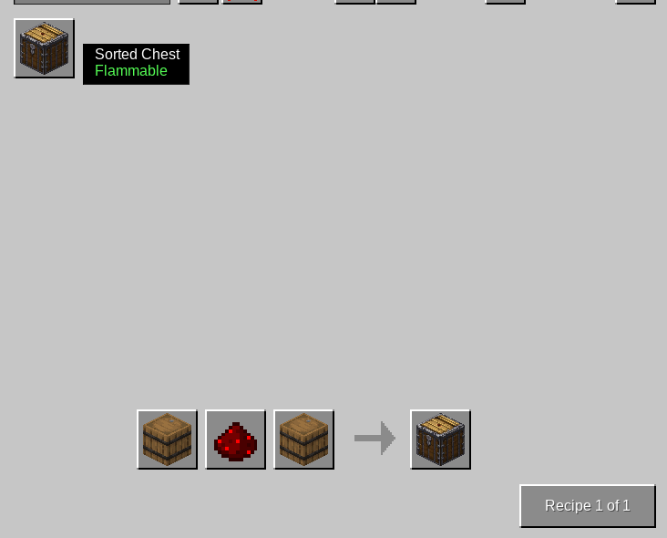

# Sorted-Storage

Sorted-Storage is a mod that adds a new chest with sorting functionality. When you interact with the chest, it automatically sorts the items inside, stacking and grouping them alphabetically. This improves inventory organization, making it easier to manage items.

## Screenshots

The Sorted Chest Interface

orted Items Grouped by Name

Crafting

## Author

This mod is created by [Kindaglia](https://github.com/Kindaglia).

---

Make sure to add the screenshot files (`example1.png`, `example2.png`, and `example3.png`) to the same folder where your `README.md` is located. These images will be displayed within the README when viewed on a platform that supports Markdown, like GitHub.